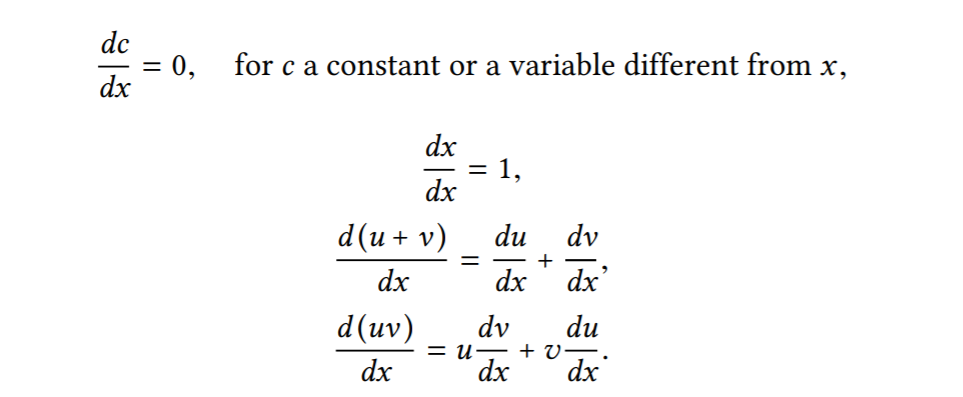
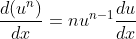

# Symbolic Differentiator

An implementation of Differential Calculus to illustrate symbol manipulation and data abstraction.

## Differentiation with abstract data
We first define a differentiation algorithm that operates on abstract objects such as “sums,” “products,” and “variables” without worrying about how these
are to be represented.

The following reduction rules can be applied to differentiate any algebraic sum or product:




> Clearly, the last two rules are **reductions** becuase each derivate produces two more derivatives which can be decomposed into smaller pieces, and thus can be solved by **recursion**.

To construct these rules, we assume that we have a _means_ for expressing algebraic expressions and therefore make three further assumptions:
* We can determine if an expression is a sum, a product, a constant or a variable.
* We can extract parts of the expression.
* We can construct expressions from these parts.

### Writing the `deriv` procedure
`deriv` takes as arguments a variable `var` with respect to which we evaluate the expression `exp`

```
(define (deriv exp var) ... 
```
A case analysis must be done for building a recursive solution. For example:

#### Rule 3
If the expression is a sum, then return the sum of the derivatives of the **addend** and the **augend**
```
(cond ((... ))
       ((sum? exp) (make-sum (deriv (addend exp) var)
                              (deriv (augend exp) var)))
                              ...)
```

The final procedure: 
```
(define (deriv exp var)
       (cond ((constant? exp) 0)
              ((same-variable? exp var) 1))
              ((sum? exp) (make-sum (deriv (addend exp) var)
                                    (deriv (augend exp) var)))
              ((product? exp)
                 (make-sum
                   (make-product (multiplier exp)
                     (deriv (multiplicand exp) var))
                   (make-product (deriv (multiplier exp) var)
                     (multiplicand exp))))
              (else
                  (error "unknown expression type" exp))))
```


The important idea is that we have encapsulated all these rules without bothering about the representation of algebraic expressions and built a procedure by esssentially assuming we have procedures like (sum?), (same-variable?), (product?) etc. Once these rules are decided, we figure out the representation of the expressions.

## Representing expressions
The encapsulated rules are embedded in the language we're using - Racket. We take advantage of this fact:
* Expressions in (Lisp & Scheme &) Racket are written using **list structure.** We can exploit the properties of this structure to represent algebraic expressions for the differentiator.
* Quotation is a feature which can be used to quote a data object and refer to it as a syntactic entity rather than semantic. It also allows us to type in compound objects.

Racket uses parenthesized prefix notation for combinations, example `(+ (* x y) z) `. This lets us define constructors, selectors and predicates like for products:
```
(define (product? x) (and (pair? x) (eq? (car x) '*)))
(define (multiplier p) (cadr p))
(define (multiplicand p) (caddr p))
```
The rest of them are in ![/dataRep.rkt]dataRep.rkt

---------------------------------------------------

## Efficient construction
Looking at the behaviour of `deriv`:
```
> (define foo    ;; ax^2+bx+c
  '(+ (* a (* x x))
      (+ (* b x)
         c)))
> (deriv foo 'x) ;; derivative of foo with respect to x
'(+
  (+ (* a (+ (* x 1) (* 1 x))) (* 0 (* x x)))
  (+ (+ (* b 1) (* 0 x)) 0))
```
This is albeit correct but clearly an unsimplified mess. To fix this, we remember that the derivative rules are _abstracted_ away from the representation of the expressions by **interface procedures** such as `constant?`, `make-sum`, `product?` and so on. Thus, we can change the constructors and selectors without changing `deriv`.

While making a sum, that if both summands are numbers, make-sum will add them and return their sum. Also, if one of the summands is 0, then make-sum will return the other summand - 
```
(define (make-sum a1 a2)
        (cond ((=number? a1 0) a2)
              ((=number? a2 0) a1)
              ((and (number? a1) (number? a2))
               (+ a1 a2))
              (else (list '+ a1 a2))))
```
`make-product` is also defined accordingly. Both use `=number?` which checks if the expression is equal to a given number and is defined in ![/dataRep.rkt]dataRep.rkt

## Handling exponenets
To extend  the differentiator to handle more rules such as the power rule: 



We define more interface procedures :smile:.
And as apparent from the equation above, the expression is a reduction into a product and can therefore be defined recursively - 
```
((exponentiation? exp) 
          (make-product  
               (make-product (exponent exp)  
                      (make-exponentiation (base exp)  
                            (if (number? (exponent exp))  ;; check that exponent is not an variable as otherwise the power rule wouldn't apply  
                                 (- (exponent exp) 1) 
                                 (' (- (exponent exp) 1))))) 
               (deriv  (base exp) var)))
```
Like products and sums, the definition is written assuming `base`, `exponent`, `exponentiation?` and `make-exponentiation` are defined. The next step is to actually write them! (check ![/dataRep.rkt]dataRep.rkt :wink:)

## Infix notation
